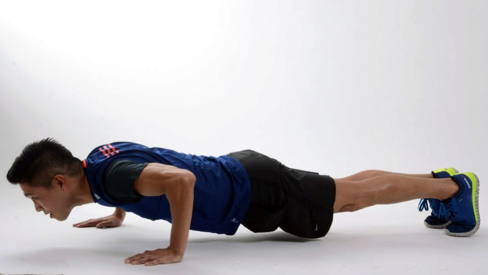
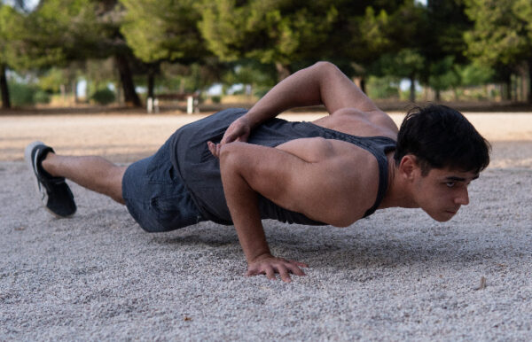
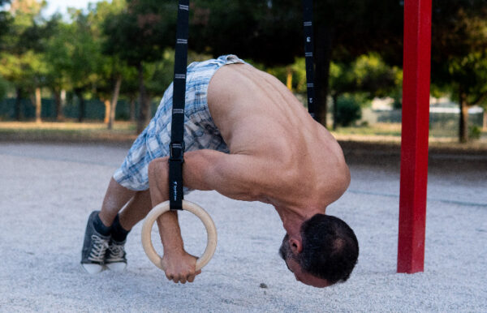
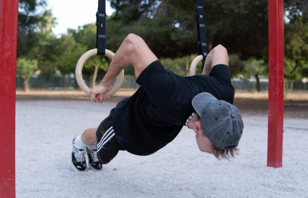
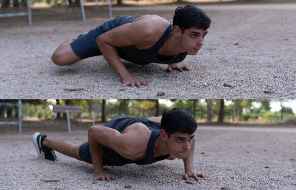
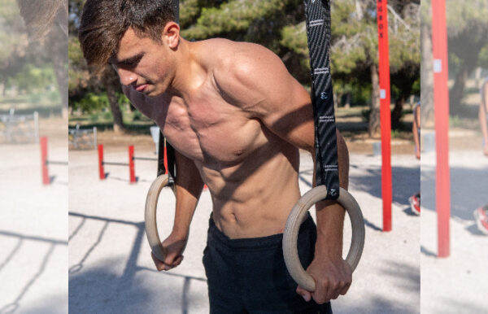
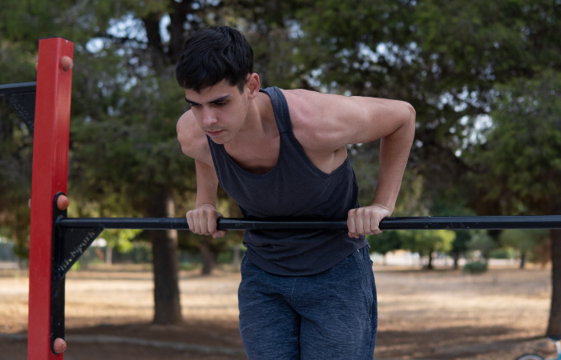
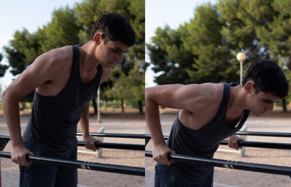

# Calistenia - Información

## Introducción

Según [Wikipedia](https://es.wikipedia.org/wiki/Calistenia) (a día 5 de agosto de 2023):

> La calistenia es un proceso de ejercicios físicos **con el propio peso corporal**. En este sistema, el interés está en los movimientos de las cadenas musculares que componen nuestro cuerpo. Etimológicamente la palabra proviene del griego kalos (belleza) y sthenos (fortaleza). El objetivo es la adquisición de fuerza, resistencia, agilidad, equilibrio, coordinación y flexibilidad a través de un entrenamiento con el propio peso corporal.

## Ejercicios

A continuación voy a ir acumulando tanto información como imágenes y vídeos de calistenia, en bruto y de forma desordenada.

### Hombros

A continuación se listan una serie de ejercicios físicos que principalmente van a ejercitar los **hombros**.

#### Flexiones

Existen distintos tipos de flexiones.

##### Flexiones 

##### Flexiones a un brazo

##### Flexiones en pica

##### Flexiones pelicano

##### Flexiones spiderman

#### Fondos

Existen distintos tipos de fondos.

##### Fondos simples

##### Fondos en barra

##### Fondos rusos

##### Flexiones sobre rodillas 

Versión «light» de las flexiones estándar. Son ideales para ganar fuerza en los tríceps y pectoral, en caso de que estés empezando. Ten en cuenta que, al apoyarte en las rodillas, estás limitando todo el trabajo de estabilización que realiza el core.

##### Flexiones cerradas

Consiste en disminuir la apertura de las manos, con tal de centrarte más en el estímulo de los tríceps.

##### Flexiones abiertas

Amplías la apertura de las manos para enfocarte más en el pectoral.

##### Flexiones inclinadas

Misma forma que las push ups estándar, pero buscando un punto de apoyo donde elevarte. De esta forma, restas dificultad al ejercicio.

##### Flexiones declinadas

Misma forma que las push ups, pero buscando un punto de apoyo donde elevar tus piernas. Así logras hacer el ejercicio más difícil e incidir más en el trabajo de los hombros.

##### Pike push ups o flexiones en pica

Una variante superior a las flexiones declinadas. Es el primer paso hacia las flexiones de pino. Su ejecución se centra en flexionar la cadera y estirar las piernas, para lograr poner el cuerpo en caseta (V invertida). Una vez consigues esta postura, la fase excéntrica o negativa consiste en llevar la cabeza hacia el centro del espacio que dejas entre ambas manos.

##### Pike push ups elevadas

Es igual que un pike push up básica, pero elevando las piernas en un cajón o algo por el estilo. Son el paso previo a las handstand push ups asistidas.

##### Push up de diamante

Consiste en juntar las manos hasta que pulgares e índices se toquen, para luego ejecutar una flexión. Lo que consigues es centrar el trabajo en los tríceps (más aún que en las flexiones cerradas).

##### Single leg push ups

Son flexiones estándar donde elevas una de las dos piernas. En este movimiento entra en juego tu equilibrio y un trabajo extra del core para mantener la estabilidad. Entrénalas alternando la pierna de apoyo.

##### Push up hindú

Partes de una posición de caseta o V invertida, para después bajar y realizar un arco con el cuerpo para finalizar en la posición opuesta. Es un ejercicio un tanto peculiar y que requiere cierta flexibilidad en la zona lumbar.

##### Archer push up

Partes de una posición con los brazos abiertos y distribuyes el peso del cuerpo hacia un lado. La forma restante se asemeja a la de un arquero al tensar su arco, de ahí que recibiese ese nombre.

##### Flexión explosiva

Es una flexión estándar donde ejecutas la fase concéntrica o positiva con mucha potencia, incluso llegando a separar las manos del suelo. Es la base de muchas otras variantes que juegan con la explosividad de las flexiones para obtener distintos resultados.

##### Flexiones con puños

Variante en la que se usan los puños como apoyo, en vez de tener la palma de la mano abierta. La única diferencia con las normales es que así se activan más los flexores de las muñecas. Sinceramente, las únicas veces que las he practicado ha sido cuando entrenaba boxeo y no me daba tiempo a quitarme los guantes. Por lo demás, las veo un poco incómodas.

##### Finger tip push ups o flexiones con los dedos

Si las anteriores me parecían incómodas, estas lo son aún más. A no ser que quieras reforzar los dedos por algún motivo, no te recomiendo incluirlas en tus entrenamientos.

##### Ball push ups

Se llevan acabo apoyando las manos en una pelota. De esta forma, no sólo estás cerrando el agarre, sino que además tienes que hacer una fuerza extra con tal de estabilizar el balón.

##### Tiger bend push up

Durante la bajada, tendrás que retrasar los codos hasta que toquen el suelo. Es importante la técnica y ayudarse de un ligero balanceo para poder volver a la posición inicial. Son uno de los primeros pasos que hay que interiorizar cuando entrenas para aprender el tiger bend.

##### Handstand push ups

También conocidas como flexiones de pino, son uno de los ejercicios más completos de la calistenia. Para poder hacer una repetición completa, debes ejecutar un handstand primero y luego descender hasta llegar a los 90 grados de profundidad. Es muy importante tener una base previa con progresiones más sencillas.

##### Flexión con palmada

Usa tu explosividad para despegarte del suelo y realizar una palmada en el aire. Puedes complicarlo de muchas formas, hay atletas que son capaces de dar una palmada por detrás de la espalda, o incluso hacer una combinación de varias palmadas.

##### Deep push ups

Las flexiones profundas inciden más en el deltoides anterior y son ideales para reforzar la zona de cara a ejercicios más avanzados como pueden ser las planchas o hspu.

##### One arm push up

En la flexión a un brazo debes colocar las piernas con un poco de apertura y el brazo con el que vas a realizar la repetición centrado y alineado con tu hombro. La posición característica de este ejercicio de calistenia tan conocido, consigue que estés centrando tus esfuerzos en el bíceps y el tríceps. Por supuesto, estarás aplicando una carga elevada, por lo que asegúrate de estar preparado para ellas.

##### Pseudo push ups

El punto de apoyo de tus manos baja esta vez, dejando de estar paralelo a los hombros para colocarse más hacia el inicio del abdomen. A su vez, las manos rotan buscando abrirse y de esta forma no comprometer tanto las muñecas. Son un ejercicio muy útil como base para ganar fuerza de empuje y reforzar los hombros, enfocado principalmente a las planchas.

##### 180 push ups

Una vez adquieras un nivel alto de explosividad, puedes tratar de hacer una flexión cambiando la orientación del cuerpo en 180 grados. Al principio parece imposible, pero entendiendo la técnica enseguida se empieza a coger el truco.

##### Superman push ups

Variante de las flexiones explosivas en la que estiras hacia adelante ambos brazos en el aire. El resultado es la característica pose de Superman mientras surca los cielos.

##### 90 degree push ups

Consiste en pasar de handstand a elbow planche (plancha a codos) y volver a la posición inicial. Es un ejercicio avanzado que requiere de una base sólida de flexiones de pino, un control perfecto de la fase negativa y estar habituado a realizar elbow planche, o al menos que te salga con facilidad.

##### Flexión en barra o single bar push up

Debes usar una barra o paralelas y situarlas perpendiculares a tu cuerpo. Más allá de eso, la repetición es normal, sólo cambia la posición del agarre. Es ligeramente más complicada que la versión sin barra, ya que el punto de apoyo de la mano disminuye.

##### Inverted wrist push ups

Son un caso poco común en el que inviertes la posición de las manos, buscando una supinación y la consecuente activación del bíceps. Hay defensores y detractores de este ejercicio. Personalmente creo que hay formas mucho mejores de entrenar el bíceps, incluso si estás en casa y tienes pocos recursos. Por ejemplo, puedes usar bandas elásticas.

##### Flexiones lastradas o weighted push ups

Añade peso a tus sesiones ya sea con un chaleco, un disco, una mochila… Lastrarse (con cabeza y una buena programación), siempre es efectivo y te dará grandes progresos, tanto en este como en cualquier ejercicio básico.

##### Straddle planche push ups

Como dice el nombre, es hacer una flexión manteniendo la posición de la straddle planche. Para ello, deberás tener una plancha muy sólida, porque sino acabarás comprometiendo la técnica.

##### Full planche push ups

Como dice el nombre, es hacer una flexión en posición de full planche. Como en el caso anterior, debes tener varios segundos de plancha antes de probar este ejercicio.

##### Flexiones con bandas elásticas

Complicas el ejercicio con la resistencia de una banda elástica. Prueba los distintos tipos de bandas elásticas (clasificadas por colores generalmente) y elige un peso acorde a tu nivel.

##### Spiderman push up

Partiendo de la posición inicial, tu rodilla debe buscar tu codo, sin necesidad de llegar a tocarlo. Lo mismo con el lado opuesto. Es un movimiento con el que mejorarás tu movilidad de cadera, además ganar fuerza de empuje.

##### 90 degree push ups

Y una más de regalo. Este es un ejercicio de calistenia bastante avanzado, que consiste en pasar de handstand a elbow planche (plancha a codos) y volver a la posición inicial. Es un ejercicio avanzado que requiere de una base sólida de flexiones de pino, un control perfecto de la fase negativa y estar habituado a realizar elbow planche, o al menos que te salga con facilidad.

## Fuentes

A continuación se listan las fuentes de las cuales he estado recopilando esta información. Más allá de Google y Youtube, claro.

- **Ignittion: mejores ejercicios de calistenia:**
  - [https://ignittion.es/blogs/tutoriales-calistenia/mejores-ejercicios-de-calistenia/](https://ignittion.es/blogs/tutoriales-calistenia/mejores-ejercicios-de-calistenia/)
- **Solo Street Workout:**
  - [https://www.solostreetworkout.com/tipos-de-push-ups-calistenia/](https://www.solostreetworkout.com/tipos-de-push-ups-calistenia/)